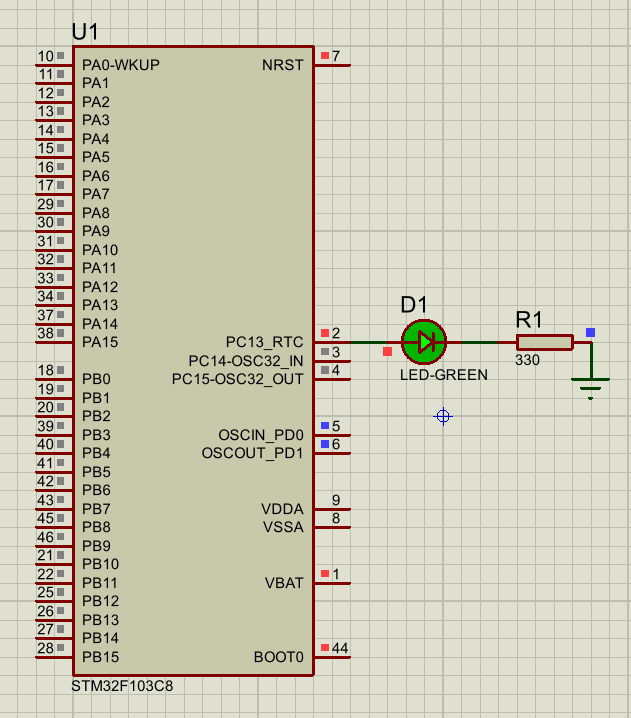
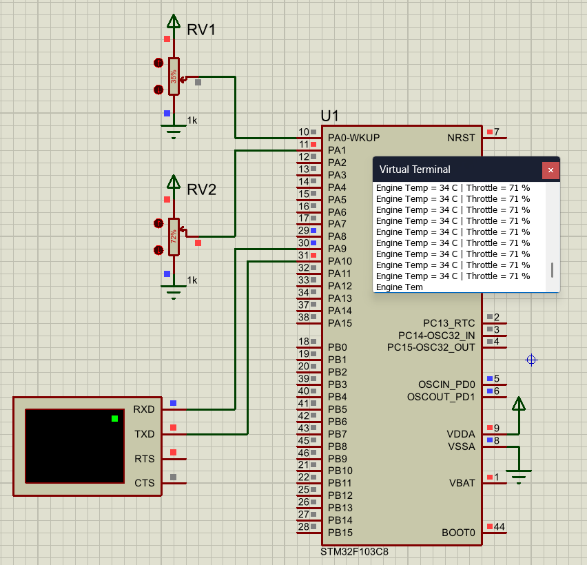
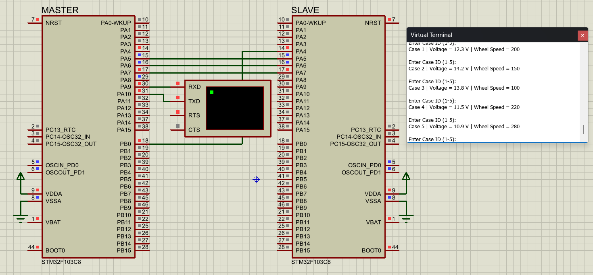
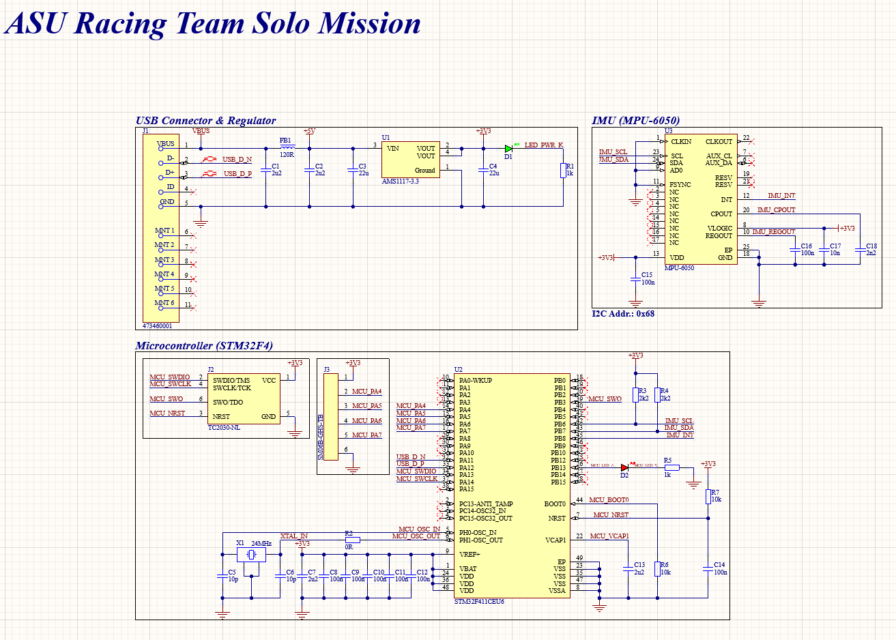
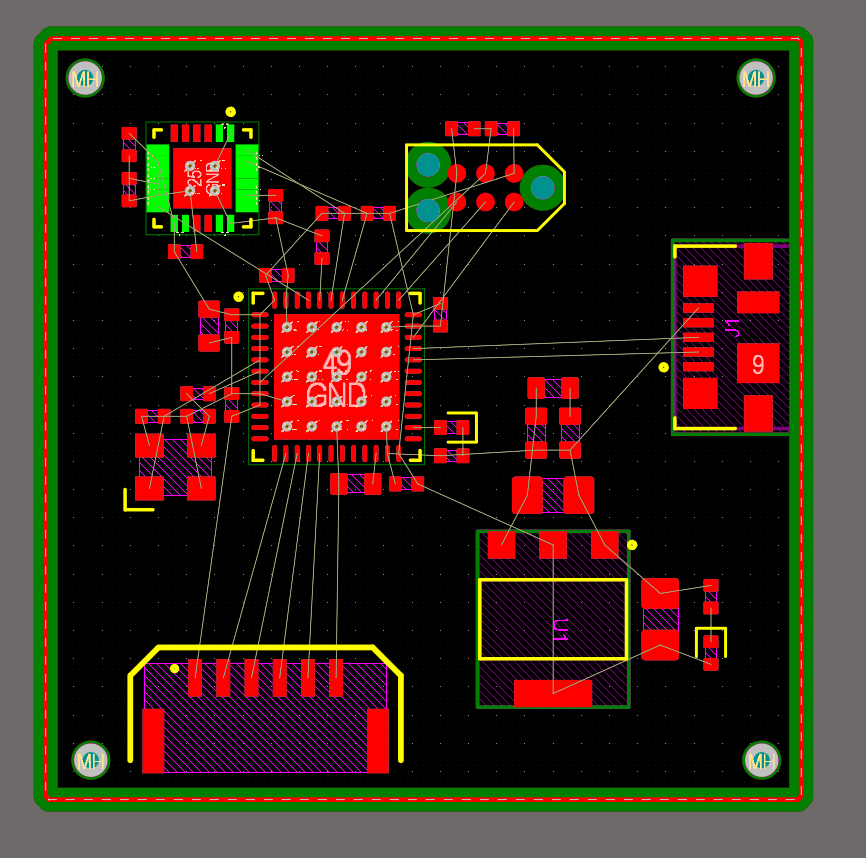
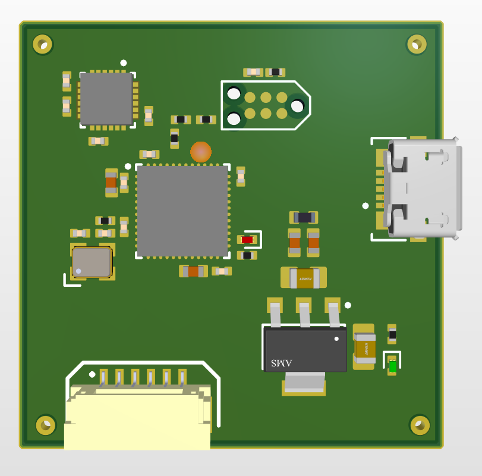

# Low Voltage Solo Mission

This repository contains the work for the Low Voltage Solo Mission.

Current structure:

```text
LV_Solo_Mission/
├── STM32/
│   ├── Milestone_1/
│   │   ├── CubeIDE/
│   │   ├── Proteus/
│   │   └── Screenshots/
│   │       ├── Milestone_1.mp4
│   │       └── Milestone_1.png
│   │
│   ├── Milestone_2/
│   │   ├── CubeIDE/
│   │   ├── Proteus/
│   │   └── Screenshots/
│   │       ├── Milestone_2.mp4
│   │       └── Milestone_2.png
│   │
│   └── Milestone_3/
│       ├── CubeIDE/
│       │   ├── Milestone3_Master/
│       │   └── Milestone3_Slave/
│       ├── Proteus/
│       └── Screenshots/
│           └── Milestone_3.png
│
└── PCB/
    └── Coming soon
```

---

# STM32 Projects

## Milestone 1 — GPIO LED Blinking

The first milestone demonstrates basic GPIO output control using the STM32F103C8.

The configured output pin is toggled periodically to blink an LED in Proteus.

### Screenshot



### Demonstration Video

[Watch Milestone 1 Demo](STM32/Milestone_1/Screenshots/Milestone_1.mp4)

### Files

- `STM32/Milestone_1/CubeIDE/` — STM32CubeIDE project
- `STM32/Milestone_1/Proteus/` — Proteus simulation
- `STM32/Milestone_1/Screenshots/` — screenshot and demonstration video

---

## Milestone 2 — ADC and UART Monitoring

The second milestone reads two analog signals using the STM32 ADC.

Two potentiometers represent Engine Temperature and Throttle Position. The ADC readings are scaled and transmitted through USART1 to a Virtual Terminal in Proteus.

### Screenshot



### Demonstration Video

[Watch Milestone 2 Demo](STM32/Milestone_2/Screenshots/Milestone_2.mp4)

### Files

- `STM32/Milestone_2/CubeIDE/` — STM32CubeIDE project
- `STM32/Milestone_2/Proteus/` — Proteus simulation
- `STM32/Milestone_2/Screenshots/` — screenshot and demonstration video

---

## Milestone 3 — SPI Master/Slave Communication

The third milestone uses two STM32F103C8 microcontrollers communicating over SPI.

### Master MCU

- Receives the Case ID from the Virtual Terminal using USART1
- Sends the Case ID to the Slave over SPI
- Receives the encoded response from the Slave
- Decodes and displays Voltage Level and Wheel Speed

### Slave MCU

- Stores the predefined case data
- Receives the Case ID from the Master
- Encodes Voltage Level and Wheel Speed into a 24-bit response
- Sends the response back to the Master

### Screenshot



### CubeIDE Projects

- `STM32/Milestone_3/CubeIDE/Milestone3_Master/`
- `STM32/Milestone_3/CubeIDE/Milestone3_Slave/`

### Other Files

- `STM32/Milestone_3/Proteus/` — Proteus SPI simulation
- `STM32/Milestone_3/Screenshots/` — simulation screenshot

---

# PCB

## Due to licensing issues, I was not able to finish this project on time.






